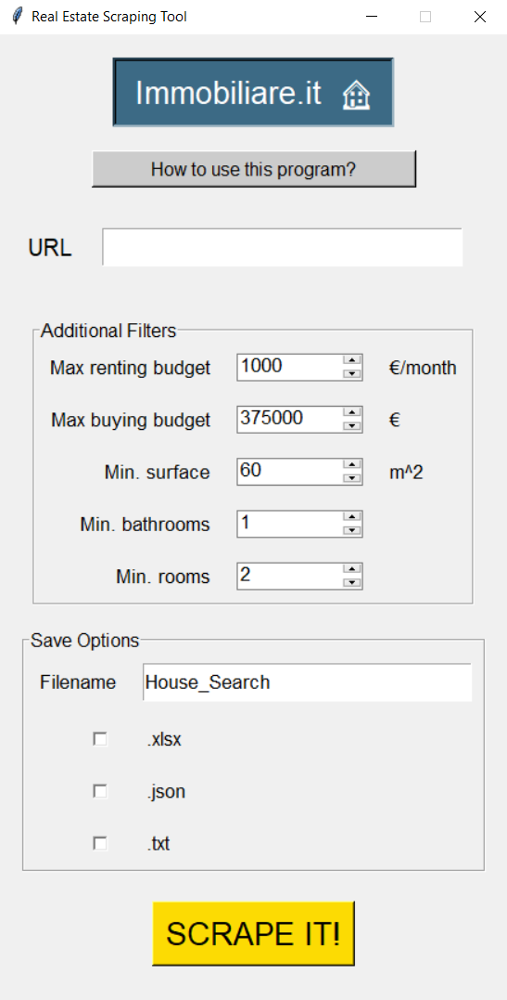
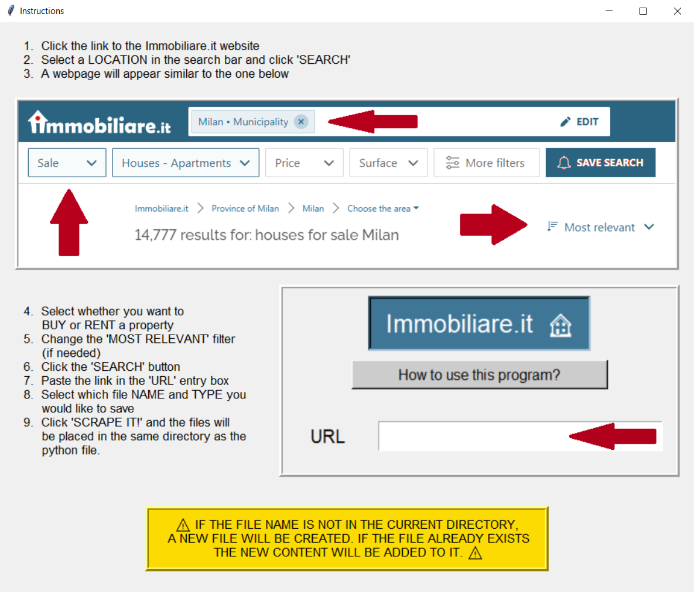

# 🏠 Real Estate Web Scraper

This is a web scraper built with Python and implemented with the TKinter module. 
The user is able to paste a URL from the immobiliare.it real estate website into an entry box,
select a set of parameters to filter for suitable properties, and generate an output file 
in a text, JSON or Excel format. 

## ⭐ Main Features

- Use of BeautifulSoup and requests module to scrape listing web page from immobiliare.it
- Able to filter out unsuitable listings directly from the GUI 
- Can select export option as a .txt file, .xlsx file, or a .json file
- It is possible to specify the output file name in the GUI and have the extensions added automatically according to the exported file format
- Results from multiple searches can be added to the same file 


## 🖥 GUI Screenshots




## 🧱 Modules

Python version 3 is necessary in order to run this project, as well as installing the
modules below. In order to run the program, simply download the script and pictures 
into a folder on your computer. The output files will also be created in that folder.

```bash
  pip install bs4
  pip install openpyxl
  pip install json
  pip install webbrowser
  pip install pathlib
  pip install requests
```
    
## ⚙ How Does it Work?

The program's goal is to automate collecting information from the immobiliare.it
real estate website. It uses the BeautifulSoup and requests module in Python 3 to 
read the HTML contents of any web page on the website that contains multiple listings, 
such as the one below.


### Web Scraping Function

This functions works by getting the website URL place in the entry box GUI, then it uses
the requests and bs4 module to get the HTML contents of the webpage. The script
automatically determines whether the properties are in the 'buy', 'rent' or 'auction' categories
and sets the webpage's "category" variable. 

The program then iterates over the 'li' tags (each containing a listing, a.k.a. 'packet').
For each property listing, the program sets empty variables for each feature (e.g. 'title', 'price',
'surface') and it grabs each one of them one by one. The program also converts the features
from strings to integers when necessary, and it strips them of their excess characters (e.g.
the '€' symbol).

Inside the function, the user's input parameters are given variable names and an empty variable
'strikes' is set to zero. When the user's input is compared to the property features, and the
property feature does not satisfy the requirement, strike += 1 for each feature. If the 
strikes are not zero, then the program does nothing, but if they are, then a dictionary 
output with the property values is created as the function's output. When strikes = 0, the
listed property is deemed suitable. 

The final output is a dictionary, with each key-value pair representing a property.
The key is the listing title, and the value is a dictionary of its features, also including 
the title. This result is printed in the console (if the program is being run from the 
python interpreter).

### Add to File functions

Each of the add-to-file functions first create the file name and extension based on the
user's input, then check if the file already exists in the program's folder. If it does, 
then the content will be added to it, otherwise the file will be created.

The **'add_to_excel'** function creates or adds to a workbook with each property feature as a 
column header. It also creates an 'end' column. This is needed, since a new 'max row' has to
be created **before** features are added by the dictionary. Since the dictionary items cannot
be ordered, the new row can't be created when adding one of the features, otherwise data on 
the previous 'max row' could be overwritten. If the webpage has non-standard entries a 
try-except statement is used to catch them for every feature. 

The **add_to_json** function works by 'duping' the dictionary output in the JSON file. It is
able to catch two exceptions: TypeError (if an item in the dictionary cannot be serialized) 
and JSONDecodeError (if the JSON file opened is not the correct JSON format)

The **add_to_txt** function works by iterating over each dictionary key-value pair and
formatting each of them into a readable, organised output. 
## ➕ Extra Features

- On top of the page, the GUI has an embedded link to the immobiliare.it website
- The user gets an 'info' message in case the search did not yield any results
- Instructions on how to obtain a valid link to scrape are available in the program
- The program automatically detects whether a set of properties is in the 'buy' or 'rent' category


## ▶ Future Improvements

- Isolate the address from the listing title and add a Google Maps link in the output files
- Include other websites such as idealista.it 
- Prevent duplicates from being added to the existing listing files
- Add option to iterate over all the listing pages (over a range specified by the user), as opposed to one link at a time

